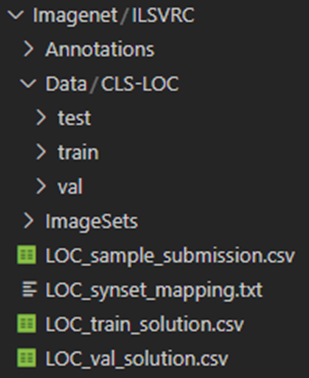

# ResNet-50 Image Classification on ImageNet-1000 datset from scratch
Aim: 
- to train resnet 50 from scratch on imagenet 1000 datasets
- achieve a 70 % accuaracy in maximum 100 epochs

# Overview
- used pytorch
- trained on spot instance g4dn 2xLarge
- all configurations added in config.yaml
- since spot instance, saved model checkpoints to resume training
- added seed for reproduction to resume training
- model checkpoints and logs were saved in S3 
- used mixed precision training
- 1 epoch was taking 1 hour to run as single gpu max batch size of 256
- trained for 24 epochs (time constraint) and achived an accuarcy of 58%
- IDE used is VS code (windows) connected to ec2 via ssh 
- Model uploaded to Hugging Face Spaces for trial
- Link for Hugging Face:

https://huggingface.co/spaces/s37jain/imagenet1000


# STEPS to set up project: 


## 1. activate virtual env

```
python m venv venv
(conda activate pytorch) if using conda environment
source venv/bin/activate  #(on linux) 
git clone <repo name>

```

## 2. install requirements
```
pip install -r requirements.txt
```

## 3. Download Imagenet Datasets from kaggle (about 2 hours)

https://www.kaggle.com/c/imagenet-object-localization-challenge/data

```
pip install kaggle
import kaggle 
dowanload dataset -kaggle competitions download -c im
```

### configure kaggle your  Kaggle credententials and accept compettion to download the data. 


### push to s3 for Reproducibility(Optional)

```
aws s3 cp /path/to/your/file.zip s3://your-bucket-name/
```
### pulling from S3 (ptional)
```
aws s3 cp  s3://your-bucket-name/  /path/to/your/file.zip
```


## 4. Unzip the data: (about 45 minutes)
```
sudo apt install unzip -y
unzip Imagenet.zip
```

## 5. Modify datasets: will need to modify the validation dataset in correct format first:
         


### run this below code to fix validation folder structure
```
python validation_transform.py -d ./Imagenet/ILSVRC/Data/CLS-LOC/val -l ./Imagenet/LOC_val_solution.csv

```
### after download folder structure
   

## 6. Configure aws to access S3 for saving checkpoints and logs:

```
sudo apt install update
curl "https://awscli.amazonaws.com/awscli-exe-linux-x86_64.zip" -o "awscliv2.zip"
sudo apt install unzip -y
unzip awscliv2.zip
sudo ./aws/install
```

## 7. To begin training:
```
python train.py
```


## 8. Deploy usuing Gradio
- see deploy_gradio_notebook.ipynb

## 9. Prediction:

-        
-     
-     
-          


## 10. Steps for future: 

- train on g5dn 12 x large with multi gpu availablility to reduce training time
- also more memory so can increase batch size
- mutli gpu is also added in code (in train.py)
- try to run for more epochs to increase accuracy


